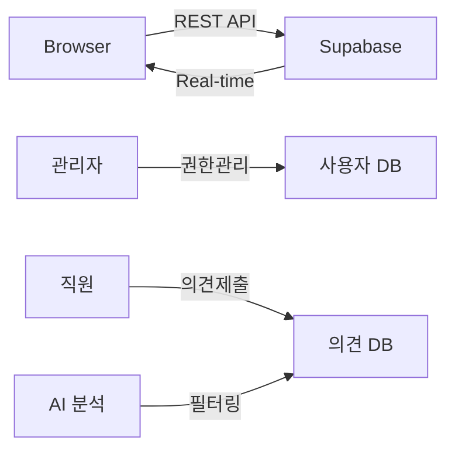

````markdown
# 열린마음협의회 PRD

## 제품 개요
| 항목 | 내용 |
| --- | --- |
| 서비스명 | **열린마음협의회 (Voice Pulse Insight)** |
| 목적 | OK금융그룹 사내 직원들의 의견을 수집·관리하고, 관리자에게 **대시보드**를 통해 통계와 최신 현황을 제공 |
| 플랫폼 | **웹(반응형)** – 데스크톱·태블릿·모바일 모두 대응 |
| 운영 대상 | **관리자/일반 직원** 권한 기반 접근 제어 |
| 백엔드 | **Supabase (PostgreSQL + Realtime)**, 사용자 인증 및 권한 관리 |

---

## 시장·문제 정의
- **의견 수집 경로 복잡** → 참여율 저하  
- **데이터 가시성 부족** → 관리자·경영진 의사결정 지연  
- **수동 집계** → 실시간 모니터링 불가, 운영 비용 증가
- **부적절 내용 관리** → AI 기반 자동 필터링 필요

> **Note:** 2024년 사내 설문 결과, 직원 62%가 "제안이 반영되는지 알 수 없다"는 불만 표시.

---

## 핵심 지표 및 목표 (KPI)
| 분류 | 지표 | 정의 | 2025 Q4 목표 |
| --- | --- | --- | --- |
| 참여도 | 월별 제안 건수 | 월간 등록 의견 수 | **+30%** (도입 前 대비) |
| 대응 | 평균 검토 완료 시간 | 의견 등록 ⇢ 관리자 상태 '처리완료'까지 소요 | **< 3일** |
| 사용성 | 대시보드 조회 빈도 | 관리자 페이지 접속 및 갱신 | 하루 **≥ 3회** |
| 품질 | 데이터 정확성 | 실제 DB ↔ 화면 오차 | **< 1%** |
| 콘텐츠 | AI 필터링 정확도 | 부적절 내용 자동 감지율 | **≥ 95%** |

---

## 사용자 시나리오

### 관리자 시나리오
1. **대시보드 접속**  
   - 로그인 → 자동 대시보드 이동 → 실시간 통계 확인
2. **의견 현황 모니터링**  
   - KPI 카드로 핵심 지표 확인 → 차트로 트렌드 분석
3. **의견 관리**  
   - 의견관리 탭 → 검색/필터링 → 상세 보기 → 상태 업데이트
4. **사용자 관리**  
   - 사용자 탭 → 전체 사용자 현황 확인 → 권한 관리
5. **블라인드 처리 확인**  
   - AI 분석 결과 3점 이상 의견 자동 마스킹 확인

### 일반 직원 시나리오
1. **의견 등록**  
   - 로그인 → 자동 의견제출 페이지 이동
   - 계열사, 카테고리, 분기 선택 → 의견 내용 작성 → 제출
2. **등록 확인**  
   - Toast 메시지로 성공 확인 → 폼 자동 초기화

---

## 기능 상세

### 1) 사용자 인증 시스템 (완료)
| 요구사항 | 수용 기준 | 구현 상태 |
| --- | --- | --- |
| 로그인/로그아웃 | 사번/비밀번호 기반, 세션 관리 | ✅ 완료 |
| 권한 관리 | 관리자/일반 사용자 구분 | ✅ 완료 |
| 사용자 등록 | 신규 사용자 등록 및 기존 사용자 정보 업데이트 | ✅ 완료 |
| 자동 리다이렉트 | 권한별 기본 페이지 자동 이동 | ✅ 완료 |

### 2) 대시보드 (완료)
| 요구사항 | 수용 기준 | 구현 상태 |
| --- | --- | --- |
| KPI 카드 4개 | 총 의견수, 참여자수, 참여율, 처리율 | ✅ 완료 |
| 실시간 통계 | Supabase를 통한 실시간 데이터 반영 | ✅ 완료 |
| 분기별/카테고리별 차트 | 컴팩트한 차트 레이아웃 | ✅ 완료 |
| 최근 의견 목록 | 카드 형태, 블라인드 처리 지원 | ✅ 완료 |

### 3) 의견 제출 시스템 (완료)
| 요구사항 | 수용 기준 | 구현 상태 |
| --- | --- | --- |
| 의견 등록 폼 | 계열사, 카테고리, 분기, 제목, 내용 입력 | ✅ 완료 |
| AI 내용 분석 | 부적절 표현 자동 감지 및 점수화 | ✅ 완료 |
| 폼 검증 | 필수 필드 검증, Toast 피드백 | ✅ 완료 |
| 자동 초기화 | 제출 성공 시 폼 리셋 | ✅ 완료 |

### 4) 의견 관리 시스템 (완료)
| 요구사항 | 수용 기준 | 구현 상태 |
| --- | --- | --- |
| 검색 및 필터링 | 키워드, 계열사, 카테고리, 분기, 상태별 검색 | ✅ 완료 |
| 의견 목록 표시 | 페이지네이션, 상세 정보 표시 | ✅ 완료 |
| 상세 보기 모달 | 전체 내용 및 처리 상태 관리 | ✅ 완료 |
| 블라인드 처리 | AI 점수 3점 이상 자동 마스킹 | ✅ 완료 |

### 5) 사용자 관리 (완료)
| 요구사항 | 수용 기준 | 구현 상태 |
| --- | --- | --- |
| 사용자 목록 | 전체 사용자 현황 카드 형태 표시 | ✅ 완료 |
| 사용자 정보 | 이름, 사번, 부서, 이메일, 권한 표시 | ✅ 완료 |
| 사용자 등록 | 신규 등록 및 기존 정보 업데이트 | ✅ 완료 |

### 6) AI 콘텐츠 필터링 (완료)
| 요구사항 | 수용 기준 | 구현 상태 |
| --- | --- | --- |
| 부적절 표현 감지 | AI 기반 0-10점 점수화 | ✅ 완료 |
| 자동 블라인드 처리 | 3점 이상 시 자동 마스킹 | ✅ 완료 |
| 시각적 구분 | 블라인드 카드 흐림 효과 및 안내 메시지 | ✅ 완료 |

---

## 데이터 흐름 요약


* **데이터 모델 (완료)**
  * `company_affiliate`: 계열사 마스터 테이블
  * `category`: 카테고리 마스터 테이블  
  * `users`: 사용자 정보 및 권한 관리
  * `opinion`: 의견 데이터 (AI 점수 포함)
  * `processing_history`: 처리 이력 관리

* **프런트**: React Query(상태관리) + Supabase Client로 실시간 데이터 처리

---

## 기술 스택 & 인프라

| 레이어 | 선택 기술 | 구현 상태 |
| --- | --- | --- |
| **프런트** | Next.js 14 + TypeScript, React Query, Tailwind CSS, Recharts | ✅ 완료 |
| **UI 컴포넌트** | shadcn/ui (Card, Button, Select, Form, Dialog 등) | ✅ 완료 |
| **백엔드** | Supabase REST API, PostgreSQL | ✅ 완료 |
| **인증** | 쿠키 기반 세션, localStorage | ✅ 완료 |
| **AI 서비스** | 외부 AI API 연동 (콘텐츠 필터링) | ✅ 완료 |
| **호스팅** | Vercel (프런트) / Supabase Cloud | ✅ 완료 |
| **모니터링** | Supabase Dashboard | ✅ 완료 |

---

## 페이지 구조 (현재)

```
/ (홈 - 로그인으로 리다이렉트)
├─ /login (로그인)
│  ├─ 로그인 폼
│  └─ 사용자 등록 모달

/dashboard (메인 시스템)
├─ 헤더 네비게이션 (권한별)
├─ 대시보드 (관리자만)
│  ├─ KPI 카드 (4개)
│  ├─ 차트 섹션 (2개)
│  └─ 최근 의견 목록
├─ 의견제출 (공통)
│  ├─ 의견 등록 폼
│  └─ AI 분석 처리
├─ 의견관리 (관리자만)
│  ├─ 검색/필터 영역
│  ├─ 의견 목록
│  └─ 상세보기 모달
└─ 사용자관리 (관리자만)
   ├─ 사용자 목록
   └─ 사용자 등록

/opinion/[id] (의견 상세)
└─ 개별 의견 상세 페이지

/admin (관리자 전용 페이지)
└─ 관리자 패널

404 (페이지 없음)
```

---

## 일정·우선순위 (업데이트)

| Phase | 기간(주) | 핵심 산출물 | 상태 |
| --- | --- | --- | --- |
| **0. 기획 확정** | W0 | PRD 승인, 요구사항 정의 | ✅ 완료 |
| **1. 설계·세팅** | W1 – W2 | Supabase 스키마, Next.js 프로젝트 구축 | ✅ 완료 |
| **2. 인증 시스템** | W3 | 로그인, 권한 관리, 사용자 등록 | ✅ 완료 |
| **3. 핵심 기능** | W4 – W6 | 의견 제출, 대시보드, 의견 관리 | ✅ 완료 |
| **4. AI 필터링** | W7 | 부적절 내용 자동 감지, 블라인드 처리 | ✅ 완료 |
| **5. 고도화** | W8 – W9 | 사용자 관리, UI/UX 개선, 반응형 최적화 | ✅ 완료 |
| **6. 운영 최적화** | W10 | 성능 튜닝, 보안 강화, 모니터링 | ✅ 완료 |

---

## 현재 구현 완료 기능
- ✅ **사용자 인증**: 로그인/로그아웃, 권한 기반 접근 제어
- ✅ **대시보드**: KPI 카드, 실시간 차트, 최근 의견 목록
- ✅ **의견 제출**: 폼 검증, AI 분석, Toast 피드백  
- ✅ **의견 관리**: 검색/필터링, 상세보기, 상태 관리
- ✅ **사용자 관리**: 사용자 목록, 정보 관리, 권한 표시
- ✅ **AI 필터링**: 부적절 내용 자동 감지, 블라인드 처리
- ✅ **반응형 디자인**: 모바일 친화적 UI
- ✅ **실시간 데이터**: Supabase 기반 즉시 반영

## 주요 특징
- 🔐 **권한 기반 UI**: 관리자/일반 사용자별 차별화된 인터페이스
- 🤖 **AI 콘텐츠 필터링**: 부적절 표현 자동 감지 및 처리
- 📊 **실시간 대시보드**: 의견 현황 즉시 반영
- 📱 **완전 반응형**: 모든 디바이스 대응
- 🎨 **일관된 디자인**: shadcn/ui 기반 통일된 UI/UX

---

## 리스크 & 대응전략

| 리스크 | 영향 | 대응 | 상태 |
| --- | --- | --- | --- |
| 실시간 데이터 지연 | 지표 신뢰도 저하 | Supabase Realtime + React Query 캐싱 | ✅ 해결 |
| 권한 관리 복잡성 | 보안 위험 | 단순한 role 기반 권한 체계 | ✅ 해결 |
| AI 필터링 오탐 | 사용성 저하 | 점수 기반 임계값 조정 가능 | ✅ 해결 |
| 대량 데이터 성능 | UX 느려짐 | 페이지네이션, 인덱스 최적화 | ✅ 해결 |
| 모바일 사용성 | 접근성 저하 | 반응형 디자인, 터치 최적화 | ✅ 해결 |

---

## 부록

### A. 벤치마크
* **기존 시스템**: 수동 집계, 엑셀 기반 관리
* **경쟁 솔루션**: Google Forms + Sheets, Microsoft Forms
* **현재 구현**: 통합 플랫폼, 실시간 분석, AI 필터링

### B. 현재 UI/UX 특징
1. **권한별 네비게이션**: 사용자 권한에 따른 메뉴 표시
2. **오렌지 브랜딩**: OK금융그룹 아이덴티티 반영
3. **카드 기반 레이아웃**: 정보 구조화 및 가독성 향상
4. **Toast 피드백**: 모든 액션에 대한 즉시 피드백
5. **블라인드 처리**: AI 분석 결과 시각적 구분
6. **반응형 그리드**: 디바이스별 최적화된 레이아웃

### C. 데이터베이스 현황
- **총 테이블**: 5개 (company_affiliate, category, users, opinion, processing_history)
- **관계**: 외래키 기반 정규화된 구조
- **인덱스**: 성능 최적화를 위한 복합 인덱스
- **보안**: RLS 비활성화 (개발 환경)
