# 열린마음협의회 사용 사례 (Use Cases)

## 📋 목차
1. [문서 개요](#문서-개요)
2. [액터 정의](#액터-정의)
3. [핵심 사용 사례](#핵심-사용-사례)
4. [시나리오별 상세 플로우](#시나리오별-상세-플로우)
5. [예외 상황 처리](#예외-상황-처리)
6. [비즈니스 규칙](#비즈니스-규칙)
7. [시스템 연동](#시스템-연동)

---

## 문서 개요

**열린마음협의회**의 모든 사용 사례를 체계적으로 정리하여 개발팀과 이해관계자들이 시스템의 동작 방식을 명확히 이해할 수 있도록 합니다.

### 기본 정보
- **시스템명**: 열린마음협의회 (Voice Pulse Insight)
- **목적**: 사내 의견 수집 및 관리 시스템
- **플랫폼**: Next.js 14 기반 웹 애플리케이션
- **기술 스택**: Next.js + TypeScript, Supabase, shadcn/ui

---

## 액터 정의

### 👤 일반 직원 (Employee)
- **역할**: 의견 제출자
- **권한**: 
  - 의견 제출
  - 본인 및 전체 의견 조회
  - 로그인/로그아웃
- **특징**: OK금융그룹 소속 직원

### 👨‍💼 관리자 (Administrator)
- **역할**: 시스템 관리자
- **권한**:
  - 모든 의견 조회/관리
  - 통계 대시보드 접근
  - 사용자 관리
  - 의견 상태 업데이트
  - Excel 내보내기
- **특징**: 관리자 권한 보유

### 🖥️ 시스템 (System)
- **역할**: 자동화된 처리
- **기능**:
  - 🧠 AI 분석 (기대효과, 적용사례 자동 생성)
  - 데이터 검증
  - 실시간 통계 계산
  - 세션 관리

---

## 핵심 사용 사례

```mermaid
graph TB
    Employee[👤 일반 직원]
    Admin[👨‍💼 관리자]
    System[🖥️ 시스템]
    
    Employee --> UC1[UC-001: 시스템 로그인]
    Employee --> UC2[UC-002: 사용자 등록]
    Employee --> UC3[UC-003: 의견 제출]
    Employee --> UC4[UC-004: 의견 목록 조회]
    Employee --> UC5[UC-005: 의견 상세보기]
    Employee --> UC6[UC-006: 로그아웃]
    
    Admin --> UC1
    Admin --> UC7[UC-007: 대시보드 조회]
    Admin --> UC8[UC-008: 의견 관리]
    Admin --> UC9[UC-009: 사용자 관리]
    Admin --> UC10[UC-010: Excel 내보내기]
    Admin --> UC3
    Admin --> UC4
    Admin --> UC5
    Admin --> UC6
    
    System --> UC11[UC-011: AI 분석 자동 처리]
    System --> UC12[UC-012: 실시간 데이터 동기화]
```



---

## 시나리오별 상세 플로우

### UC-001: 시스템 로그인

**액터**: 일반 직원, 관리자  
**목적**: 시스템에 안전하게 접근  
**전제조건**: 유효한 사번과 비밀번호 보유  

#### 📋 기본 플로우
1. **접속**: 사용자가 로그인 페이지(`/login`) 접근
2. **로그인 탭 선택**: 탭 인터페이스에서 "로그인" 탭 클릭
3. **정보 입력**: 사번과 비밀번호 입력
4. **암호화**: SHA256 해시 기반 비밀번호 암호화
5. **인증 요청**: Supabase 데이터베이스 조회
6. **권한 확인**: 시스템이 사용자 권한 확인
7. **세션 생성**: localStorage에 사용자 정보 저장
8. **리다이렉트**: 
   - 관리자 → 대시보드(`/dashboard`)
   - 일반 직원 → 대시보드(`/dashboard`)

#### ⚠️ 예외 플로우
- **E-001-01**: 잘못된 사번/비밀번호
  - Toast 에러 메시지 표시
  - 입력 필드 포커스 이동
- **E-001-02**: 네트워크 오류
  - "연결 상태를 확인해주세요" 메시지
  - 재시도 버튼 제공

---

### UC-002: 사용자 등록

**액터**: 일반 직원  
**목적**: 새로운 사용자 계정 생성  
**전제조건**: 등록되지 않은 사번  

#### 📋 기본 플로우
1. **등록 탭 선택**: 로그인 페이지에서 "사용자 등록" 탭 클릭
2. **정보 입력**: 
   - 이름, 사번, 이메일
   - 비밀번호, 비밀번호 확인
   - 계열사 선택 (Supabase 동적 로드)
   - 부서명 입력
3. **검증**: 클라이언트 사이드 유효성 검사
4. **중복 확인**: 사번 중복 여부 확인
5. **암호화**: 비밀번호 SHA256 해시 처리
6. **등록**: Supabase 사용자 테이블에 저장
7. **확인**: 성공 Toast 및 로그인 탭으로 이동

#### ⚠️ 예외 플로우
- **E-002-01**: 중복 사번
  - "이미 등록된 사번입니다" 메시지
- **E-002-02**: 비밀번호 불일치
  - "비밀번호가 일치하지 않습니다" 메시지

---

### UC-003: 의견 제출

**액터**: 일반 직원, 관리자  
**목적**: 회사에 대한 의견이나 제안사항 제출  
**전제조건**: 로그인 상태  

#### 📋 기본 플로우
1. **페이지 접근**: AppSidebar에서 "의견제출" 클릭
2. **폼 렌더링**: 
   - 카테고리 선택 (Supabase에서 동적 로드)
   - 제목 입력 (필수)
   - 제안사항 입력 (필수, 최대 1000자)
3. **정보 입력**: 사용자가 모든 필드 작성
4. **검증**: 실시간 유효성 검사 (글자 수 제한 등)
5. **제출**: Supabase에 데이터 저장
6. **🧠 AI 분석**: 자동으로 기대효과와 적용사례 생성
7. **확인**: 성공 Toast 메시지 표시
8. **초기화**: 폼 자동 리셋

#### ⚠️ 예외 플로우
- **E-003-01**: 필수 필드 누락
  - 해당 필드에 빨간 테두리
  - "필수 항목을 입력해주세요" 메시지
- **E-003-02**: 제안사항 길이 초과
  - 글자 수 제한 안내 실시간 표시
  - 입력 차단
- **E-003-03**: 제출 실패
  - "다시 시도해주세요" Toast
  - 입력 데이터 보존

---

### UC-004: 의견 목록 조회

**액터**: 일반 직원, 관리자  
**목적**: 제출된 의견 목록 확인  
**전제조건**: 로그인 상태  

#### 📋 기본 플로우
1. **페이지 접근**: AppSidebar에서 "의견목록" 클릭
2. **목록 로드**: Supabase에서 의견 데이터 조회
3. **필터 적용**:
   - 📅 연도별/분기별 필터
   - 📂 카테고리별 필터
   - 🔍 제목/내용 검색
   - 🏷️ 상태별 필터
4. **카드 형태 표시**: 각 의견을 카드로 렌더링
5. **페이지네이션**: 한 페이지당 10개씩 표시
6. **상세보기**: 카드 클릭 시 다이얼로그 팝업

#### 📊 표시 정보
- 카테고리 배지
- 제목 및 내용 미리보기
- 제출일시
- 처리 상태 배지
- 관리자 답변 여부

---

### UC-005: 의견 상세보기

**액터**: 일반 직원, 관리자  
**목적**: 의견의 상세 내용 및 AI 분석 결과 확인  
**전제조건**: 로그인 상태  

#### 📋 기본 플로우
1. **상세보기 접근**: 
   - 의견 목록에서 카드 클릭 → 다이얼로그
   - 직접 URL 접근 (`/opinion/[id]`)
2. **기본 정보 표시**:
   - 제목, 제출일시, 카테고리
   - 제출자 정보 (관리자만 실명, 일반 사용자는 마스킹)
   - 처리 상태
3. **의견 내용 표시**:
   - 제안사항 전체 내용
4. **🧠 AI 분석 결과**:
   - 📝 기대효과 (effect) - 초록색 배경
   - 📚 적용사례 (case_study) - 노란색 배경
5. **관리자 답변** (처리완료 시):
   - 답변 내용 표시
   - 답변 작성일시

#### 🔒 권한별 차이점
- **일반 사용자**: 제출자 이름 마스킹 ("OOO")
- **관리자**: 모든 정보 실명 표시 + 상태 변경 가능

---

### UC-007: 대시보드 조회

**액터**: 관리자  
**목적**: 의견 수집 현황 및 통계 모니터링  
**전제조건**: 관리자 권한으로 로그인  

#### 📋 기본 플로우
1. **페이지 로드**: AppSidebar에서 "대시보드" 클릭
2. **KPI 카드 렌더링**:
   - 📝 총 의견 수 (실시간)
   - 👥 참여자 수
   - 📊 참여율 계산
   - ⚡ 처리율 표시
3. **차트 생성**:
   - 📈 분기별 의견 추이 (라인 차트)
   - 🥧 카테고리별 분포 (파이 차트)
4. **최근 의견 테이블**:
   - 최신 10건 표시
   - 클릭 시 상세 모달

#### 📊 실시간 데이터
- Supabase Realtime 구독으로 즉시 반영
- React Query로 캐싱 및 자동 갱신

---

### UC-008: 의견 관리

**액터**: 관리자  
**목적**: 제출된 의견 검토 및 상태 관리  
**전제조건**: 관리자 권한으로 로그인  

#### 📋 기본 플로우
1. **관리자 패널 접근**: AppSidebar에서 "관리자" 클릭
2. **고급 검색 및 필터**:
   - 🔎 통합 검색 (사번, 이름, 제목, 내용)
   - 📅 분기/연도 필터
   - 🏷️ 상태 필터 (접수/처리중/답변완료)
   - 📂 카테고리 필터
   - 🏢 계열사 필터
3. **검색 결과 테이블**: 조건에 맞는 의견 표시
4. **상세보기 모달**: 의견 클릭 → OpinionDetailModal
5. **상태 업데이트**: 
   - 처리상태 변경 (접수→처리중→답변완료)
   - 답변 내용 작성
6. **저장**: 변경사항 Supabase에 저장

#### 🔍 고급 검색 기능
- **통합 검색**: 여러 필드 동시 검색
- **필터 조합**: 다중 조건 필터링
- **정렬**: 날짜, 상태별 정렬
- **페이지네이션**: 대량 데이터 처리

---

### UC-009: 사용자 관리

**액터**: 관리자  
**목적**: 시스템 사용자 현황 파악  
**전제조건**: 관리자 권한으로 로그인  

#### 📋 기본 플로우
1. **사용자 관리 접근**: 관리자 패널 내 "사용자 관리" 섹션
2. **사용자 목록 조회**: Supabase에서 전체 사용자 로드
3. **사용자 카드 정보**:
   - 👤 이름, 사번
   - 🏢 소속 계열사, 부서
   - 📧 이메일 주소
   - 🏷️ 권한 레벨 (user/admin)
   - 📊 의견 제출 현황

#### 💳 사용자 카드 구성
```
사용자 카드
├── 아바타 이미지 (자동 생성)
├── 기본 정보
│   ├── 이름
│   ├── 사번
│   ├── 부서
│   └── 이메일
├── 권한 배지 (user/admin)
└── 활동 통계
    ├── 제출한 의견 수
    └── 최종 로그인 일시
```

---

### UC-010: Excel 내보내기

**액터**: 관리자  
**목적**: 의견 데이터를 Excel 파일로 내보내기  
**전제조건**: 관리자 권한으로 로그인  

#### 📋 기본 플로우
1. **내보내기 버튼**: 관리자 패널에서 "Excel 내보내기" 클릭
2. **데이터 준비**: 현재 필터 조건에 맞는 의견 데이터 수집
3. **Excel 생성**: 
   - 기본 정보 (제목, 카테고리, 제출일시)
   - 의견 내용 (제안사항)
   - AI 분석 결과 (기대효과, 적용사례)
   - 처리 정보 (상태, 답변)
4. **다운로드**: 브라우저에서 자동 다운로드

#### 📊 Excel 파일 구조
| 컬럼 | 내용 |
|------|------|
| 순번 | seq |
| 카테고리 | category.name |
| 제목 | title |
| 제안사항 | tobe |
| 기대효과 | effect |
| 적용사례 | case_study |
| 상태 | status |
| 제출일시 | created_at |
| 답변 | proc_desc |

---

### UC-011: AI 분석 자동 처리

**액터**: 시스템  
**목적**: 의견 제출 시 AI 기반 자동 분석  
**전제조건**: 의견 제출 이벤트  

#### 📋 자동 처리 플로우
1. **의견 제출 감지**: OpinionSubmissionForm에서 제출 이벤트
2. **AI 분석 요청**: 
   - 제목과 제안사항을 기반으로 분석
   - 기대효과 생성 (effect)
   - 적용사례 생성 (case_study)
3. **결과 저장**: Supabase에 AI 분석 결과 저장
4. **UI 반영**: 상세보기에서 AI 분석 결과 표시

#### 🧠 AI 분석 내용
- **기대효과**: 제안이 실현될 경우 예상되는 긍정적 효과
- **적용사례**: 유사한 사례나 타 기업 성공 사례
- **부적절 표현 감지**: negative_score로 수치화

---

### UC-012: 실시간 데이터 동기화

**액터**: 시스템  
**목적**: Supabase Realtime을 통한 실시간 데이터 동기화  
**전제조건**: 브라우저 활성 상태  

#### 📋 실시간 동기화 프로세스
1. **Realtime 구독**: Supabase Realtime 채널 구독
2. **변경 감지**: 의견 테이블 변경사항 실시간 감지
3. **캐시 갱신**: React Query 캐시 무효화
4. **UI 업데이트**: 관련 컴포넌트 자동 리렌더링

---

## 예외 상황 처리

### 🚨 시스템 레벨 예외

#### E-SYS-001: 네트워크 연결 오류
- **감지**: API 호출 실패 (Supabase 연결 실패)
- **처리**: 
  1. 오프라인 상태 감지
  2. "인터넷 연결을 확인해주세요" Toast 표시
  3. 재연결 시 자동 재시도

#### E-SYS-002: Supabase 서비스 장애
- **감지**: 연속된 API 실패
- **처리**:
  1. 오류 페이지 표시
  2. 서비스 복구 안내
  3. 재시도 버튼 제공

#### E-SYS-003: 권한 없는 접근
- **감지**: localStorage 인증 정보 없음
- **처리**:
  1. 로그인 페이지로 자동 리다이렉트
  2. "로그인이 필요합니다" 메시지

### 💡 사용자 레벨 예외

#### E-USER-001: 잘못된 입력
- **폼 검증 오류**: 실시간 피드백
- **데이터 형식 오류**: 입력 가이드 제공
- **필수 필드 누락**: 시각적 하이라이트

#### E-USER-002: 브라우저 호환성
- **구버전 브라우저**: 업그레이드 안내
- **JavaScript 비활성화**: 활성화 가이드
- **localStorage 지원 없음**: 대체 방안 안내

---

## 비즈니스 규칙

### 📋 의견 제출 규칙
1. **제출 자격**: 등록된 사용자만 가능
2. **중복 제출**: 제한 없음 (동일 카테고리 중복 허용)
3. **내용 제한**: 
   - 제목: 최소 1자 이상
   - 제안사항: 최소 10자 이상, 최대 1000자 이하
4. **AI 분석**: 모든 의견에 자동 적용

### 🔐 권한 및 보안
1. **관리자 권한**: role 필드로 구분 (user/admin)
2. **세션 유효기간**: localStorage 기반 (브라우저 종료 시까지)
3. **데이터 접근**: Supabase RLS 정책 적용
4. **비밀번호**: SHA256 해시 암호화

### 📊 통계 계산 규칙
1. **참여율**: (의견 제출자 수 / 전체 등록 사용자 수) × 100
2. **처리율**: (답변완료 상태 의견 수 / 전체 의견 수) × 100
3. **실시간 업데이트**: Supabase Realtime 기반 즉시 반영
4. **데이터 보존**: 무제한 (삭제 기능 없음)

---

## 시스템 연동

### 🔗 Supabase 데이터베이스 연동

#### 테이블 구조
```sql
-- 주요 테이블
opinion (의견)
├── id, seq, title, content, tobe
├── effect, case_study (AI 분석)
├── category_id, company_affiliate_id
├── status, created_at
└── user_id, proc_desc

user (사용자)
├── id, employee_id, name, email
├── password_hash, role
├── company_id, dept
└── status, created_at

category (카테고리)
├── id, name, sort_order
└── status, created_at

company_affiliate (계열사)
├── id, name
└── status, created_at
```

#### API 엔드포인트
```
READ 작업
├── GET /opinions (의견 목록)
├── GET /opinions/{id} (의견 상세)
├── GET /categories (카테고리 목록)
├── GET /company_affiliates (계열사 목록)
└── GET /users (사용자 목록)

WRITE 작업
├── POST /opinions (의견 등록)
├── POST /users (사용자 등록)
├── PUT /opinions/{id} (의견 수정)
└── PUT /users/{id} (사용자 정보 수정)
```

---

## 성능 및 품질 기준

### ⚡ 성능 요구사항
- **페이지 로드**: 3초 이내 (Next.js 최적화)
- **API 응답**: 1초 이내 (Supabase 성능)
- **차트 렌더링**: 2초 이내
- **검색 결과**: 1초 이내

### 🎯 품질 기준
- **가용성**: 99.5% 이상 (Vercel + Supabase)
- **동시 접속**: 100명 지원
- **데이터 정확도**: 99% 이상
- **브라우저 지원**: Chrome, Edge, Safari, Firefox 최신 2버전

---

## 📈 현재 구현 현황

### ✅ 완료된 사용 사례
- UC-001: 시스템 로그인 ✅
- UC-002: 사용자 등록 ✅
- UC-003: 의견 제출 ✅  
- UC-004: 의견 목록 조회 ✅
- UC-005: 의견 상세보기 ✅
- UC-006: 로그아웃 ✅
- UC-007: 대시보드 조회 ✅
- UC-008: 의견 관리 ✅
- UC-009: 사용자 관리 ✅
- UC-010: Excel 내보내기 ✅
- UC-011: AI 분석 자동 처리 ✅
- UC-012: 실시간 데이터 동기화 ✅

### 🔄 개선 예정
- 🔍 고급 검색 알고리즘 개선
- 📊 고급 통계 및 시각화
- 📱 PWA 지원 및 오프라인 기능
- 🔔 실시간 알림 시스템
- ♿ 접근성 완전 준수
- 🚀 성능 최적화 (코드 분할, 이미지 최적화)

---

**최종 업데이트**: 2024년 12월 현재  
**문서 버전**: v2.0  
**기술 스택**: Next.js 14 + Supabase + shadcn/ui  
**작성자**: AI Assistant (실제 구현 코드 분석 기반)
