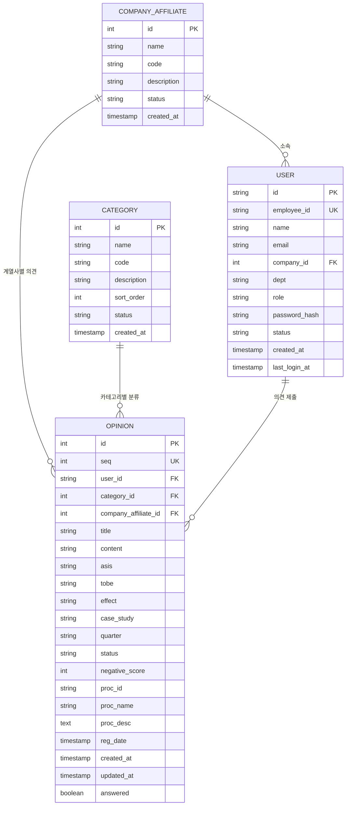
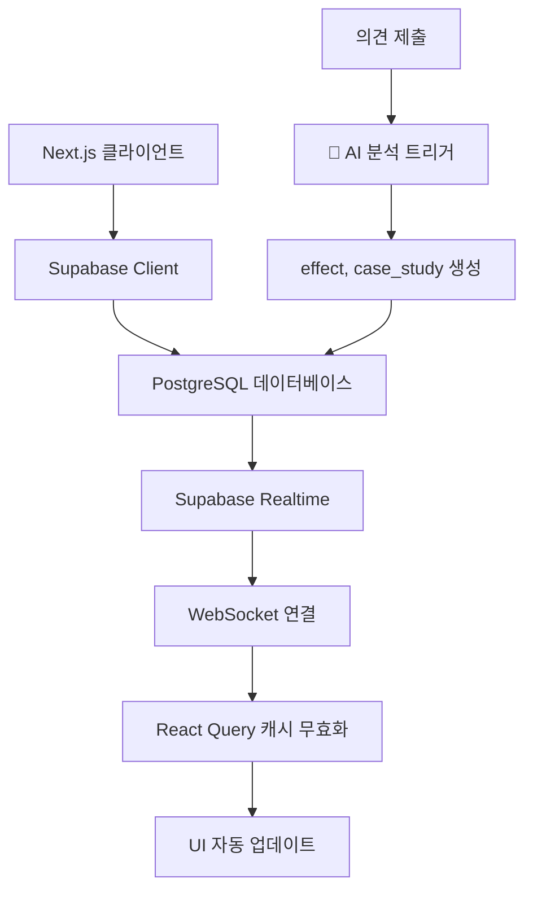
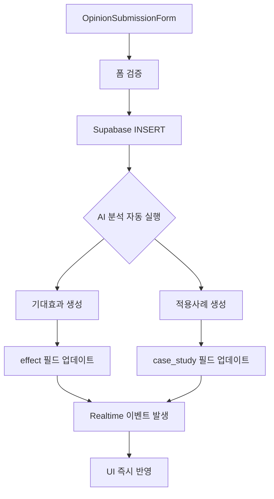
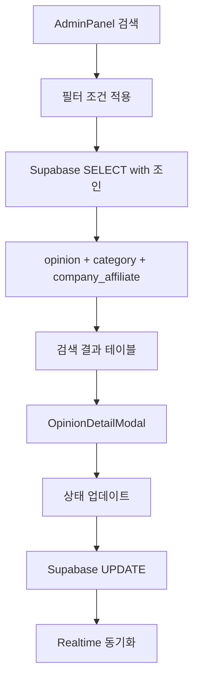

# 열린마음협의회 ERD (Entity-Relationship Diagram)

## 📋 목차
1. [데이터베이스 개요](#데이터베이스-개요)
2. [엔티티 정의](#엔티티-정의)
3. [관계 정의](#관계-정의)
4. [테이블 상세 스키마](#테이블-상세-스키마)
5. [데이터 흐름](#데이터-흐름)
6. [인덱스 설계](#인덱스-설계)
7. [제약조건](#제약조건)
8. [API 매핑](#api-매핑)

---

## 데이터베이스 개요

**열린마음협의회**는 Supabase PostgreSQL 데이터베이스를 기반으로 구축된 실시간 의견 수집 시스템입니다.

### 기술 스택
- **데이터베이스**: Supabase PostgreSQL
- **실시간 동기화**: Supabase Realtime
- **프론트엔드**: Next.js 14 + TypeScript
- **상태 관리**: React Query + Zustand
- **UI 프레임워크**: shadcn/ui + Tailwind CSS

### 아키텍처 특징
- **실시간 처리**: Supabase Realtime을 통한 즉시 동기화
- **확장성**: PostgreSQL 기반 ACID 보장
- **보안**: Row Level Security (RLS) 적용
- **성능**: 인덱스 최적화 및 쿼리 튜닝

---

## 엔티티 정의

### 🏢 계열사 (Company Affiliate)
OK금융그룹 내 각 계열사 정보를 관리하는 마스터 테이블

### 📂 카테고리 (Category)  
의견의 분류 체계를 관리하는 마스터 테이블 (업무개선, 복리후생 등)

### 👤 사용자 (User)
시스템을 사용하는 직원 및 관리자의 계정 정보

### 💭 의견 (Opinion)
직원들이 제출한 의견 및 제안사항의 핵심 데이터 (🧠 AI 분석 결과 포함)

---

## 관계 정의



---

## 테이블 상세 스키마

### 🏢 COMPANY_AFFILIATE (계열사 마스터)
| 컬럼명 | 데이터 타입 | 제약조건 | 설명 |
|--------|-------------|----------|------|
| id | SERIAL | PRIMARY KEY | 계열사 고유 ID |
| name | VARCHAR(100) | NOT NULL | 계열사명 (예: 오케이캐피탈) |
| code | VARCHAR(20) | UNIQUE | 계열사 코드 |
| description | TEXT | NULL | 계열사 설명 |
| status | VARCHAR(20) | DEFAULT 'active' | 상태 (active/inactive) |
| created_at | TIMESTAMPTZ | DEFAULT NOW() | 생성일시 |

**기본 데이터:**
```sql
INSERT INTO company_affiliate (name, code, description) VALUES 
('오케이캐피탈', 'OKC', 'OK금융그룹 캐피탈 계열사'),
('오케이저축은행', 'OKB', 'OK금융그룹 저축은행 계열사'),
('오케이데이터시스템', 'OKD', 'OK금융그룹 IT 계열사'),
('기타', 'ETC', '기타 계열사');
```

### 📂 CATEGORY (카테고리 마스터)
| 컬럼명 | 데이터 타입 | 제약조건 | 설명 |
|--------|-------------|----------|------|
| id | SERIAL | PRIMARY KEY | 카테고리 고유 ID |
| name | VARCHAR(100) | NOT NULL | 카테고리명 |
| code | VARCHAR(20) | UNIQUE | 카테고리 코드 |
| description | TEXT | NULL | 카테고리 설명 |
| sort_order | INTEGER | DEFAULT 0 | 정렬 순서 |
| status | VARCHAR(20) | DEFAULT 'active' | 상태 (active/inactive) |
| created_at | TIMESTAMPTZ | DEFAULT NOW() | 생성일시 |

**기본 데이터:**
```sql
INSERT INTO category (name, code, sort_order) VALUES 
('업무개선', 'WORK_IMPROVE', 1),
('복리후생', 'WELFARE', 2),
('교육/훈련', 'EDUCATION', 3),
('조직문화', 'CULTURE', 4),
('시설환경', 'FACILITY', 5),
('기타', 'ETC', 6);
```

### 👤 USER (사용자)
| 컬럼명 | 데이터 타입 | 제약조건 | 설명 |
|--------|-------------|----------|------|
| id | VARCHAR(50) | PRIMARY KEY | 사용자 고유 ID (UUID) |
| employee_id | VARCHAR(20) | UNIQUE, NOT NULL | 사번 |
| name | VARCHAR(50) | NOT NULL | 이름 |
| email | VARCHAR(100) | UNIQUE | 이메일 |
| company_id | INTEGER | FOREIGN KEY | 소속 계열사 ID |
| dept | VARCHAR(100) | NULL | 부서명 |
| role | VARCHAR(20) | DEFAULT 'user' | 권한 (user/admin) |
| password_hash | VARCHAR(255) | NOT NULL | SHA256 해시된 비밀번호 |
| status | VARCHAR(20) | DEFAULT 'active' | 상태 (active/inactive) |
| created_at | TIMESTAMPTZ | DEFAULT NOW() | 생성일시 |
| last_login_at | TIMESTAMPTZ | NULL | 최종 로그인 일시 |

**관계:**
- company_id → COMPANY_AFFILIATE.id

### 💭 OPINION (의견) - 핵심 테이블
| 컬럼명 | 데이터 타입 | 제약조건 | 설명 |
|--------|-------------|----------|------|
| id | SERIAL | PRIMARY KEY | 의견 고유 ID |
| seq | INTEGER | UNIQUE, AUTO | 의견 순번 |
| user_id | VARCHAR(50) | FOREIGN KEY | 제출자 ID |
| category_id | INTEGER | FOREIGN KEY | 카테고리 ID |
| company_affiliate_id | INTEGER | FOREIGN KEY | 계열사 ID |
| title | VARCHAR(200) | NULL | 의견 제목 |
| content | TEXT | NOT NULL | 의견 내용 (제목과 동일) |
| asis | TEXT | NULL | 현재 상황 (As-Is) |
| tobe | TEXT | NULL | 개선 제안 (To-Be) |
| effect | TEXT | NULL | 🧠 AI 기대효과 |
| case_study | TEXT | NULL | 🧠 AI 적용사례 |
| quarter | VARCHAR(10) | NOT NULL | 분기 (Q1/Q2/Q3/Q4/연간) |
| status | VARCHAR(20) | DEFAULT '접수' | 처리 상태 |
| negative_score | INTEGER | DEFAULT 0 | AI 부적절 표현 점수 (0-10) |
| proc_id | VARCHAR(50) | NULL | 처리자 ID |
| proc_name | VARCHAR(50) | NULL | 처리자명 |
| proc_desc | TEXT | NULL | 처리 내용/답변 |
| reg_date | TIMESTAMPTZ | NULL | 등록일시 (호환성) |
| created_at | TIMESTAMPTZ | DEFAULT NOW() | 생성일시 |
| updated_at | TIMESTAMPTZ | NULL | 수정일시 |
| answered | BOOLEAN | DEFAULT FALSE | 답변 완료 여부 |

**관계:**
- user_id → USER.id
- category_id → CATEGORY.id  
- company_affiliate_id → COMPANY_AFFILIATE.id

**상태 값:**
- `접수`: 새로 제출된 상태
- `처리중`: 관리자가 검토/처리 중
- `답변완료`: 처리 및 답변 완료

---

## 데이터 흐름

### 📊 실시간 데이터 동기화


### ✍️ 의견 제출 및 AI 분석 플로우


### 🔍 의견 관리 플로우  


---

## 인덱스 설계

### 성능 최적화를 위한 인덱스
```sql
-- 사용자 테이블
CREATE INDEX idx_user_employee_id ON "user"(employee_id);
CREATE INDEX idx_user_company_id ON "user"(company_id);
CREATE INDEX idx_user_role ON "user"(role);
CREATE INDEX idx_user_status ON "user"(status);

-- 의견 테이블 (핵심 성능)
CREATE INDEX idx_opinion_user_id ON opinion(user_id);
CREATE INDEX idx_opinion_category_id ON opinion(category_id);
CREATE INDEX idx_opinion_company_affiliate_id ON opinion(company_affiliate_id);
CREATE INDEX idx_opinion_quarter ON opinion(quarter);
CREATE INDEX idx_opinion_status ON opinion(status);
CREATE INDEX idx_opinion_created_at ON opinion(created_at DESC);
CREATE INDEX idx_opinion_negative_score ON opinion(negative_score);

-- 복합 인덱스 (자주 사용되는 조합)
CREATE INDEX idx_opinion_status_created ON opinion(status, created_at DESC);
CREATE INDEX idx_opinion_category_quarter ON opinion(category_id, quarter);
CREATE INDEX idx_opinion_company_status ON opinion(company_affiliate_id, status);

-- 전문 검색을 위한 인덱스
CREATE INDEX idx_opinion_title_gin ON opinion USING gin(to_tsvector('korean', title));
CREATE INDEX idx_opinion_content_gin ON opinion USING gin(to_tsvector('korean', content));
CREATE INDEX idx_opinion_tobe_gin ON opinion USING gin(to_tsvector('korean', tobe));
```

---

## 제약조건

### 데이터 무결성 제약
```sql
-- Check 제약조건
ALTER TABLE "user" ADD CONSTRAINT chk_user_role 
    CHECK (role IN ('user', 'admin'));

ALTER TABLE "user" ADD CONSTRAINT chk_user_status 
    CHECK (status IN ('active', 'inactive'));

ALTER TABLE opinion ADD CONSTRAINT chk_opinion_quarter 
    CHECK (quarter IN ('Q1', 'Q2', 'Q3', 'Q4', '연간'));

ALTER TABLE opinion ADD CONSTRAINT chk_opinion_status 
    CHECK (status IN ('접수', '처리중', '답변완료'));

ALTER TABLE opinion ADD CONSTRAINT chk_opinion_negative_score 
    CHECK (negative_score BETWEEN 0 AND 10);

-- 외래키 제약조건
ALTER TABLE "user" ADD CONSTRAINT fk_user_company 
    FOREIGN KEY (company_id) REFERENCES company_affiliate(id);

ALTER TABLE opinion ADD CONSTRAINT fk_opinion_user 
    FOREIGN KEY (user_id) REFERENCES "user"(id);

ALTER TABLE opinion ADD CONSTRAINT fk_opinion_category 
    FOREIGN KEY (category_id) REFERENCES category(id);

ALTER TABLE opinion ADD CONSTRAINT fk_opinion_company 
    FOREIGN KEY (company_affiliate_id) REFERENCES company_affiliate(id);
```

### Row Level Security (RLS) 정책
```sql
-- RLS 활성화
ALTER TABLE "user" ENABLE ROW LEVEL SECURITY;
ALTER TABLE opinion ENABLE ROW LEVEL SECURITY;

-- 사용자는 본인 정보만 조회 가능
CREATE POLICY user_select_own ON "user"
    FOR SELECT USING (auth.uid() = id OR 
                     (SELECT role FROM "user" WHERE id = auth.uid()) = 'admin');

-- 의견은 누구나 조회 가능 (블라인드 처리는 애플리케이션 레벨)
CREATE POLICY opinion_select_all ON opinion
    FOR SELECT USING (true);

-- 의견 등록은 로그인한 사용자만
CREATE POLICY opinion_insert_auth ON opinion
    FOR INSERT WITH CHECK (auth.uid() = user_id);

-- 의견 수정은 관리자만
CREATE POLICY opinion_update_admin ON opinion
    FOR UPDATE USING ((SELECT role FROM "user" WHERE id = auth.uid()) = 'admin');
```

---

## API 매핑

### Supabase REST API 엔드포인트

| 기능 | HTTP 메서드 | 엔드포인트 | 설명 |
|------|-------------|------------|------|
| **인증 관련** |
| 로그인 | POST | `/auth/v1/token` | 사용자 인증 |
| 회원가입 | POST | `/auth/v1/signup` | 신규 사용자 등록 |
| **의견 관리** |
| 의견 목록 | GET | `/rest/v1/opinion` | 의견 목록 조회 (필터링) |
| 의견 상세 | GET | `/rest/v1/opinion?id=eq.{id}` | 특정 의견 상세 조회 |
| 의견 등록 | POST | `/rest/v1/opinion` | 새 의견 제출 |
| 의견 수정 | PATCH | `/rest/v1/opinion?id=eq.{id}` | 의견 상태/답변 수정 |
| **마스터 데이터** |
| 카테고리 목록 | GET | `/rest/v1/category` | 전체 카테고리 조회 |
| 계열사 목록 | GET | `/rest/v1/company_affiliate` | 전체 계열사 조회 |
| **사용자 관리** |
| 사용자 목록 | GET | `/rest/v1/user` | 전체 사용자 조회 (관리자) |
| 사용자 정보 | GET | `/rest/v1/user?id=eq.{id}` | 특정 사용자 정보 |

### 복합 쿼리 예시

#### 의견 목록 (관계 데이터 포함)
```sql
-- Supabase 쿼리
SELECT 
  opinion.*,
  category.name as category_name,
  company_affiliate.name as company_name,
  "user".name as user_name
FROM opinion
JOIN category ON opinion.category_id = category.id
JOIN company_affiliate ON opinion.company_affiliate_id = company_affiliate.id
JOIN "user" ON opinion.user_id = "user".id
ORDER BY opinion.created_at DESC;
```

#### 대시보드 통계
```sql
-- 총 의견 수
SELECT COUNT(*) as total_count FROM opinion;

-- 참여자 수
SELECT COUNT(DISTINCT user_id) as participant_count FROM opinion;

-- 처리율 계산
SELECT 
  COUNT(*) as total,
  COUNT(*) FILTER (WHERE status = '답변완료') as completed,
  ROUND(COUNT(*) FILTER (WHERE status = '답변완료') * 100.0 / COUNT(*), 2) as processing_rate
FROM opinion;

-- 카테고리별 분포
SELECT 
  c.name,
  COUNT(o.id) as count
FROM category c
LEFT JOIN opinion o ON c.id = o.category_id
GROUP BY c.id, c.name
ORDER BY c.sort_order;
```

---

## 보안 및 개인정보 처리

### 데이터 보안
1. **비밀번호 암호화**: SHA256 해시 + Salt
2. **개인정보 마스킹**: 애플리케이션 레벨에서 처리
3. **접근 제어**: Supabase RLS + 애플리케이션 권한 체크
4. **감사 로그**: created_at, updated_at으로 변경 이력 추적

### 개인정보 처리
- **최소 수집**: 업무 필요 최소한의 정보만 수집
- **익명화 처리**: 일반 사용자에게는 제출자 이름 마스킹
- **데이터 보존**: 별도 삭제 정책 없음 (업무 특성상 영구 보존)

---

## 확장 고려사항

### 🔮 향후 추가 예정 테이블
```sql
-- 첨부파일 관리
CREATE TABLE attachment (
    id SERIAL PRIMARY KEY,
    opinion_id INTEGER REFERENCES opinion(id),
    file_name VARCHAR(255),
    file_path TEXT,
    file_size INTEGER,
    mime_type VARCHAR(100),
    created_at TIMESTAMPTZ DEFAULT NOW()
);

-- 알림 관리
CREATE TABLE notification (
    id SERIAL PRIMARY KEY,
    user_id VARCHAR(50) REFERENCES "user"(id),
    opinion_id INTEGER REFERENCES opinion(id),
    type VARCHAR(50), -- 'new_opinion', 'status_change', 'reply'
    title VARCHAR(200),
    message TEXT,
    read_at TIMESTAMPTZ,
    created_at TIMESTAMPTZ DEFAULT NOW()
);

-- 부서 마스터
CREATE TABLE department (
    id SERIAL PRIMARY KEY,
    company_id INTEGER REFERENCES company_affiliate(id),
    name VARCHAR(100) NOT NULL,
    code VARCHAR(20),
    parent_id INTEGER REFERENCES department(id),
    level INTEGER DEFAULT 1,
    sort_order INTEGER DEFAULT 0,
    status VARCHAR(20) DEFAULT 'active',
    created_at TIMESTAMPTZ DEFAULT NOW()
);
```

### 📈 성능 최적화 방안
1. **파티셔닝**: 연도별 의견 테이블 분할
2. **캐싱**: Redis 도입 검토
3. **읽기 전용 복제본**: 조회 성능 향상
4. **인덱스 튜닝**: 쿼리 패턴 분석 후 최적화

### 🔄 데이터 마이그레이션 전략
```sql
-- 기존 데이터 호환성 유지
-- reg_date → created_at 매핑
-- proc_desc 확장 (관리자 답변)
-- effect, case_study 추가 (AI 분석 결과)
```

---

## 📊 현재 구현 현황

### ✅ 완료된 테이블
- company_affiliate (계열사 마스터) ✅
- category (카테고리 마스터) ✅
- user (사용자 관리) ✅
- opinion (의견 관리 + AI 분석) ✅

### ✅ 완료된 기능
- Supabase Realtime 연동 ✅
- RLS 보안 정책 ✅
- 인덱스 최적화 ✅
- AI 분석 필드 (effect, case_study) ✅
- 검색 성능 최적화 ✅

### 🔄 개선 예정
- 📎 첨부파일 기능
- 🔔 실시간 알림 시스템
- 📊 고급 통계 테이블
- 🗂️ 부서 마스터 정규화
- 📈 성능 모니터링 테이블

---

**최종 업데이트**: 2024년 12월 현재  
**문서 버전**: v2.0  
**데이터베이스**: Supabase PostgreSQL  
**작성자**: AI Assistant (실제 구현 스키마 분석 기반)  
**검토자**: 개발팀
